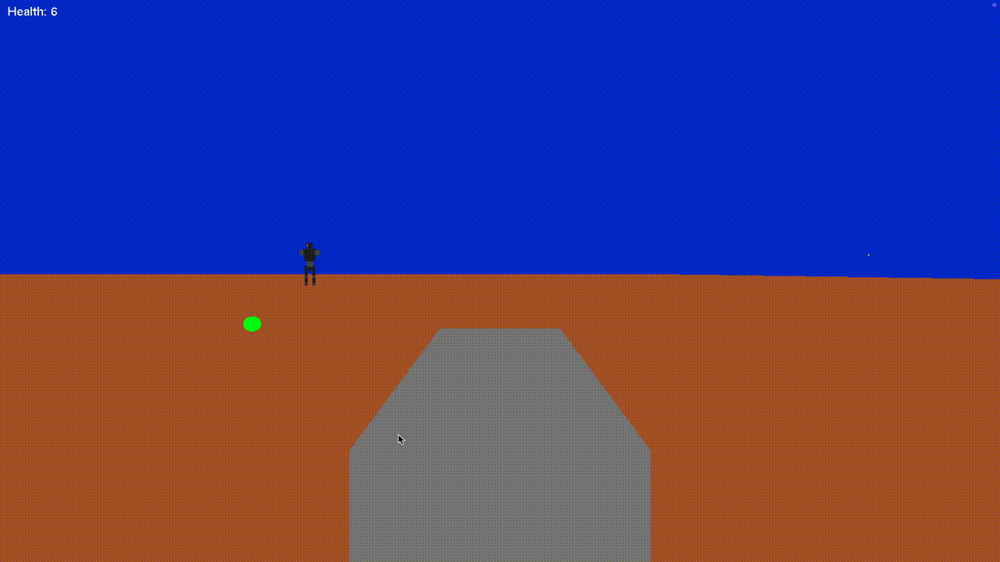

# CPS 511 Assignments: 3D Robot Evolution

This repository contains the progression of assignments for the **CPS 511: Computer Graphics** course, showcasing the design and development of a 3D robot using OpenGL and GLUT. The robot evolves across three assignments, gaining new features such as movement, weapon functionality, and enhanced interactivity.

---

## 📚 Table of Contents

- [Overview](#overview)
- [Features](#features)
- [Assignments](#assignments)
  - [Assignment 1](#assignment-1)
  - [Assignment 2](#assignment-2)
  - [Assignment 3](#assignment-3)
- [How to Run](#how-to-run)
- [Controls](#controls)
- [Dependencies](#dependencies)
- [Acknowledgments](#acknowledgments)

---

## 🧾 Overview

The project demonstrates the evolution of a 3D robot model through three assignments:

- **Assignment 1 (A1):** Basic robot design with hierarchical modeling.
- **Assignment 2 (A2):** Introduction of surface modeling and mesh viewing.
- **Assignment 3 (A3):** Advanced robot features, including walking, weapon firing, and camera interactivity.

The robot is built using OpenGL and GLUT, with modular code for each body part and functionality.

---

## ✨ Features

### 🔧 General Features

- Hierarchical modeling for robot components.
- Modular design with separate files for each body part.
- Dynamic camera controls.

### 🧩 Assignment-Specific Features

- **A1:** 
  - Basic robot with movable arms, legs, and head.
  - Optional rotating cannon with firing functionality.
- **A2:** 
  - Surface of revolution modeling.
  - Mesh viewer for loading and visualizing `.obj` files.
  - Export functionality for saving 3D models.
- **A3:** 
  - Robot follows and rotates to face the camera.
  - Walking animation with articulated legs.
  - Enhanced interactive camera system.

---

## 📝 Assignments

### 📦 Assignment 1
- **Description:** Foundational robot design using hierarchical modeling.
- **Features:**
  - Movable arms, legs, and head.
  - Dynamic third-person camera view.
  - *Bonus:* Rotating cannon weapon.
- **Run:** Use `run.sh` inside the `A1` folder.

---

### 📦 Assignment 2
- **Description:** Focus on surface modeling and mesh visualization.
- **Features:**
  - Surface of revolution modeling interface.
  - 3D mesh viewer with `.obj` loading support.
  - Export models to disk.
- **Run:** 
  - Surface Modeler: `main.sh`
  - Mesh Viewer: `view.sh {your .obj file}` inside the `A2` folder.

---

### 📦 Assignment 3
- **Description:** Enhanced robot with animation and environmental interaction.
- **Features:**
  - Robot follows and rotates toward the camera.
  - Walking animation for legs and body.
  - Real-time camera interactivity.
- **Run:** Use `run.sh` inside the `A3` folder.

---

## ▶️ How to Run

1. Clone the repository:
   ```bash
   Code can be run by using run.sh in each Assignmnet


---

## 🎬 Demo

